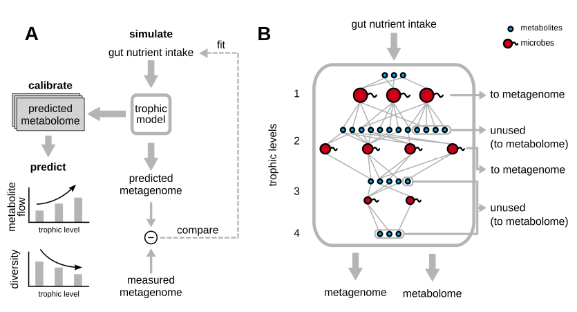

# Trophic-model-of-human-microbiome
This a trophic model of human microbiome. It optimizes the nutrient intake of the gut to minimize the error between model predicted metagenome and experimentally measured metagenome. The metabolome is generated automatically from the trophic model without fitting to it. More details about this model can be found [here](https://www.biorxiv.org/content/10.1101/603365v2).

## Brief introduction

The human gut microbiome is a complex ecosystem, in which hundreds of microbial species and metabolites coexist, in part due to an extensive network of cross-feeding interactions. Kinetic models for such ecosystems like human gut microbiome are nearly impossible because several thousands of kinetic parameters are needed to build such kinetic models. Here, using a simplied model, we provide quantitative support for a multi level trophic organization of the human gut microbiome, where microbes consume and secrete metabolites in multiple iterative steps. The model requires "a network of metabolic interaction for microbes" involving the metabolite consumption and production by microbes.

Besides the ability to provide support for a trophic organization of the human microbiome, the model has the ability to predict individual's metabolome from its metagenomic data. In the model, the nutrient intake of the gut is optimized to minimize the error between model predicted metagenome and experimentally measured metagenome. The metabolome is generated automatically from the trophic model without fitting to it. When the predicted metabolome for each individual in one dataset is compared with its experimentally measured metabolome, the Pearson correlation between two is statistically significant (Pearson correlation $0.67 \pm 0.2$; median P-value $8\times 10^{-4}$). The logarithmic error between the predicted metabolome and the experimentally measured metabolome is on average 0.8 (which is within 1 order of magnitude).

## Data processing
"Trophic_model_for_gut_data_processing.ipynb" is used to process the network data into the format required by the main code "Trophic_model_for_gut.ipynb"

## Main code
"Trophic_model_for_gut.ipynb" is the main code for running the optimization procedure of the trophic model.
